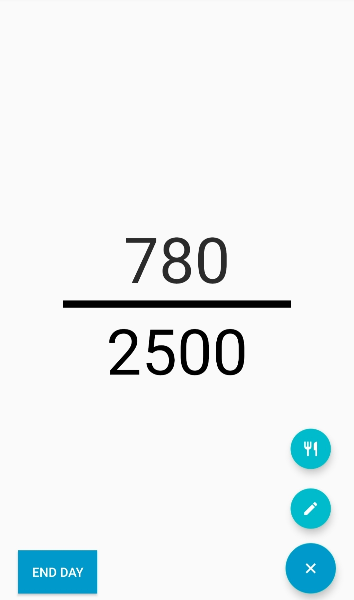
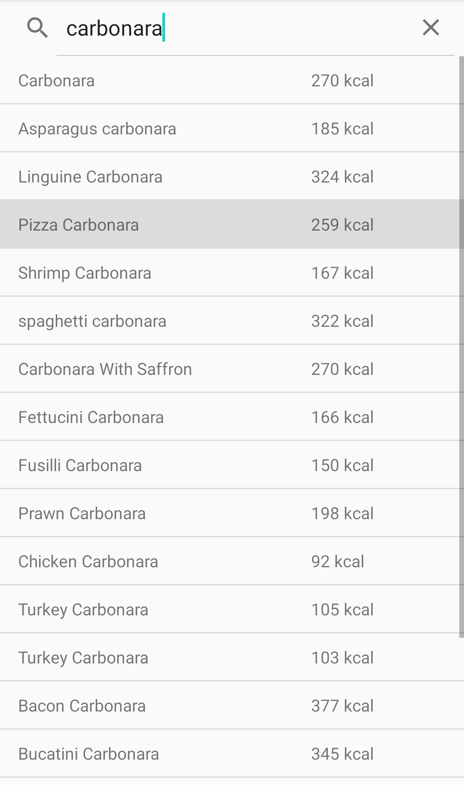
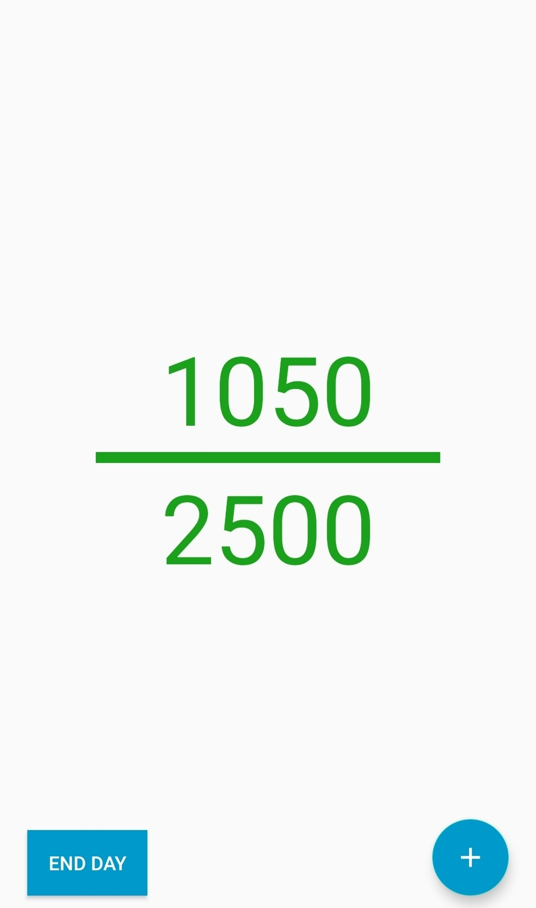
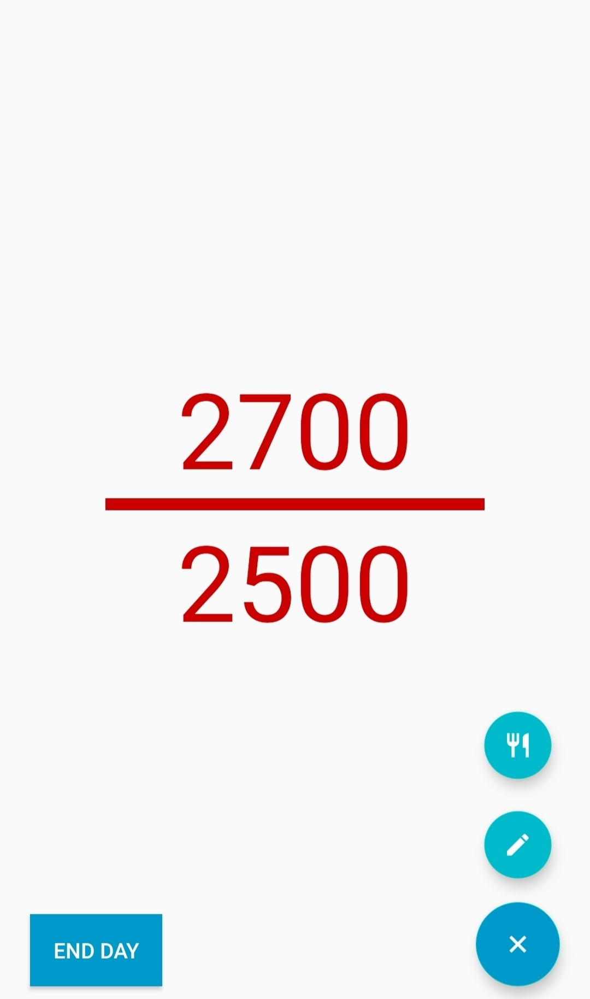

<h2 align="center">
 Satisfying Calories Tracker
</h2>

Satisfying Calories Tracker is a project created by Bruno Ponte. This Android app allows users to search for foods and add them to their daily intake, tracking the calories automatically. If the caloric goal is reached, a pleasing sound is played. Otherwise... an annoying sound is played.

  

  

  

  
  
  
  

